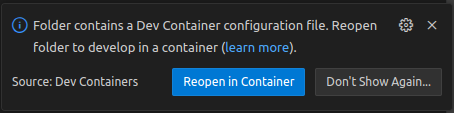

# Common DevContainer for Eclipse S-CORE
This repository contains the common [development container](https://containers.dev) for [Eclipse S-CORE](https://github.com/eclipse-score).
It contains all tools required to develop (modify, build, ...) Eclipse S-CORE.
All tool version are well-defined, and all tools are pre-configured to work as expected for Eclipse S-CORE development.
The container is [pre-built](https://containers.dev/guide/prebuild) in GitHub Actions as part of this repository, tested, published, and ready for use.

Using the pre-built container in an Eclipse S-CORE repository is described in the [Usage](#usage) section.

Modifying the content of the container is explained in the [Development](#development) section.

## Usage

> **NOTE:** There are several development environments which support development containers; most notably [Visual Studio Code](https://code.visualstudio.com), but also [IntelliJ IDEA](https://www.jetbrains.com/idea) and others.
> See [here](https://containers.dev/supporting) for a more complete list.
> In the following, we assume that [Visual Studio Code](https://code.visualstudio.com) and its Dev Containers extension is used.
The [Dev Containers extension homepage](https://marketplace.visualstudio.com/items?itemName=ms-vscode-remote.remote-containers) has a description how to get up to speed on Windows, macOS and Linux operating systems.
From here on, we assume that such a development container setup is installed and running.

Add a file called `.devcontainer/devcontainer.json` to your repository.
It should contain the following:

````json
{
    "name": "eclipse-score",
    "image": "ghcr.io/elektrobit/eclipse-score_devkit:<version>",
    "initializeCommand": "mkdir -p ${localEnv:HOME}/.cache/bazel"
}
````

The `<version>` must be a [valid, published release](https://github.com/Elektrobit/eclipse-score_devkit/tags).

To start using the container, click the **Reopen in Container** button when prompted by Visual Studio Code:



Alternatively, you can press Ctrl-Shift-P and run from there "Dev Containers: Reopen in Container".

The first time you do this, the container will be downloaded.
This may take some time.
Afterwards, Visual Studio Code should show this in the lower right corner of your window:


Open a Terminal, and - for example - type `bazel build ...` to execute the default build of the repository.

To enable the C++ [language server](https://microsoft.github.io/language-server-protocol/) (`clangd`) to support C++ navigation and auto-completion together with Visual Studio Code, use the pre-configured [Task](https://code.visualstudio.com/docs/debugtest/tasks) "Update compile_commands.json" (via "Terminal" -> "Run Task...").
This will create a file called [`compile_commands.json`](https://clang.llvm.org/docs/JSONCompilationDatabase.html), which is the base for `clangd` to start indexing the source code.

Congratulations, you are now a dev container enthusiast 😊.

## Development

> **NOTE:** This is about the development *of the DevContainer*, not about development of Eclipse S-CORE *using* the DevContainer.

The [Eclipse S-CORE](https://github.com/eclipse-score) development container is developed using - a development container!
That means, the usage is similarly simple:

````
git clone https://github.com/eclipse-score/devcontainer.git
cd devcontainer
code .
````
and "Reopen in Container".

### Repository Structure
Ordered by importance:

* `src/s-core-devcontainer/` contains the sources for the Eclipse S-CORE DevContainer.
It uses pre-existing [DevContainer features](https://containers.dev/implementors/features/) to provide some standard tools like Git, Rust, and LLVM.
In addition, it uses a so-called "local" feature (cf. `src/s-core-devcontainer/.devcontainer/s-core-local`) for the remaining tools and configuration.
* `scripts/` contains scripts to build, test and publish the container.
They are used by the CI, but especially the build and test scripts can be run also locally out of the box:
````console
$ ./scripts/build.sh
[... build output..]

$ ./scripts/test.sh
[... container start and test output...]
````
* `.devcontainer/` contains the definition of the DevContainer for **this** repository, i.e. the "devcontainer devcontainer".
There should rarely be a need to modify this.
* `.github/` contains the regular GitHub setup, with code owners and CI.
* `resources/` contains a few screenshots.
